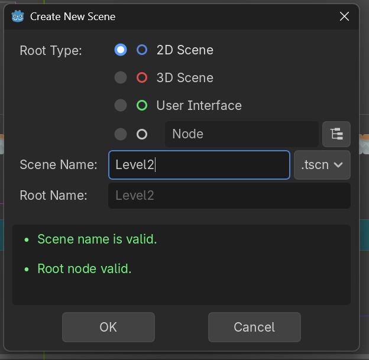
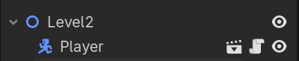
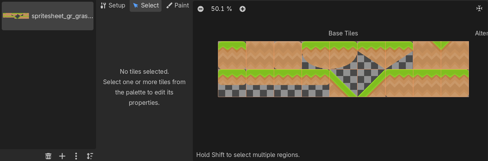
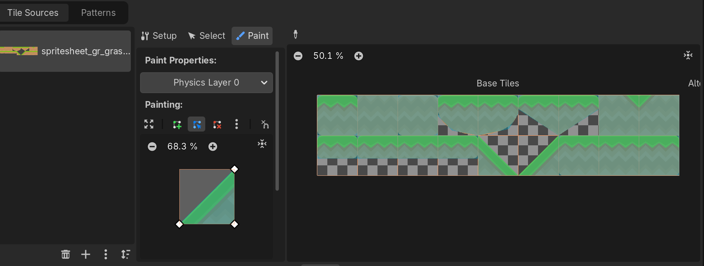
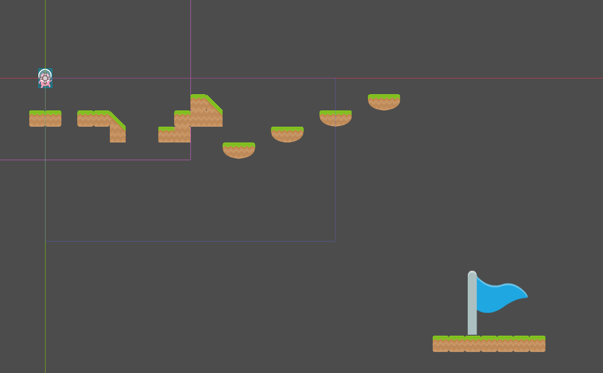
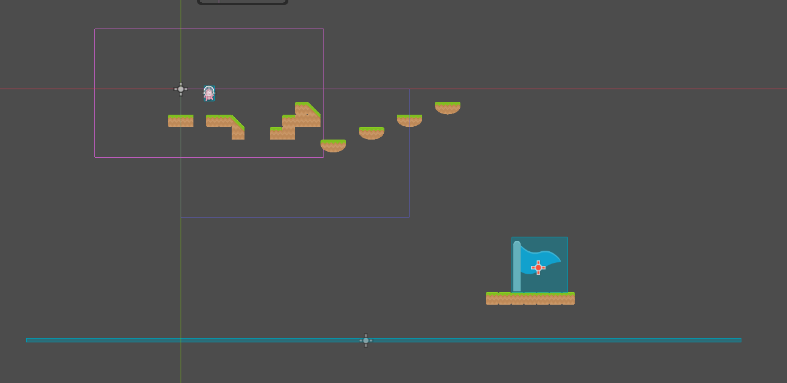
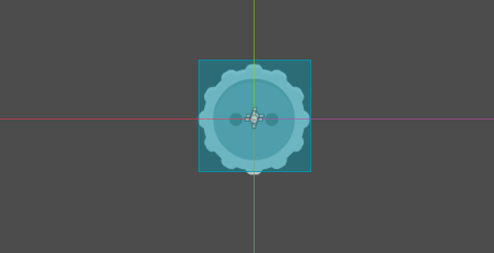
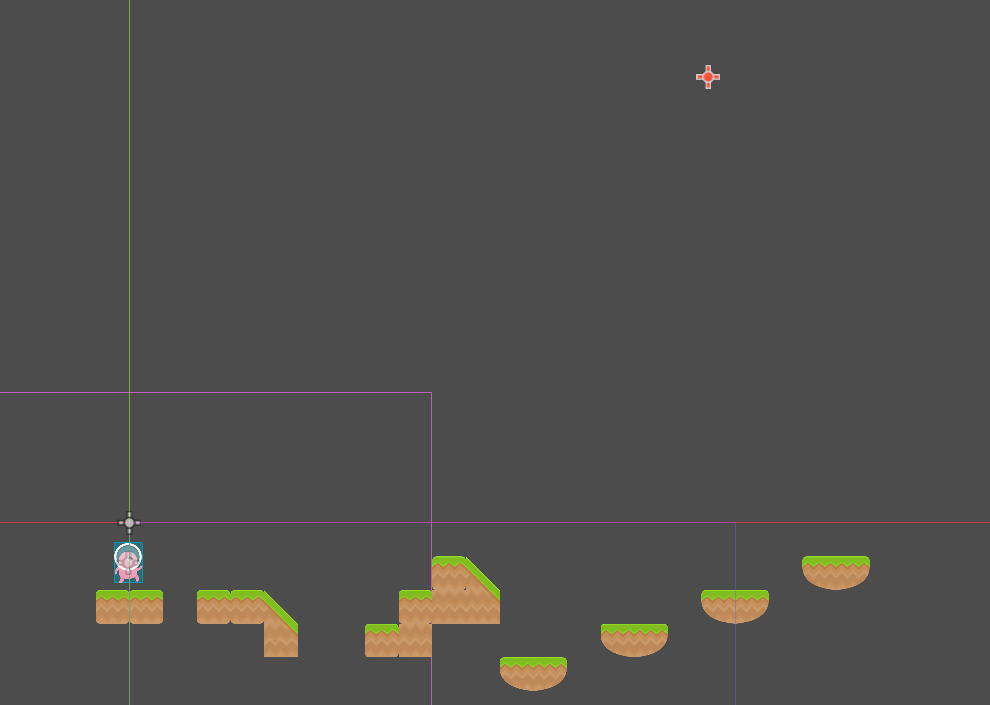
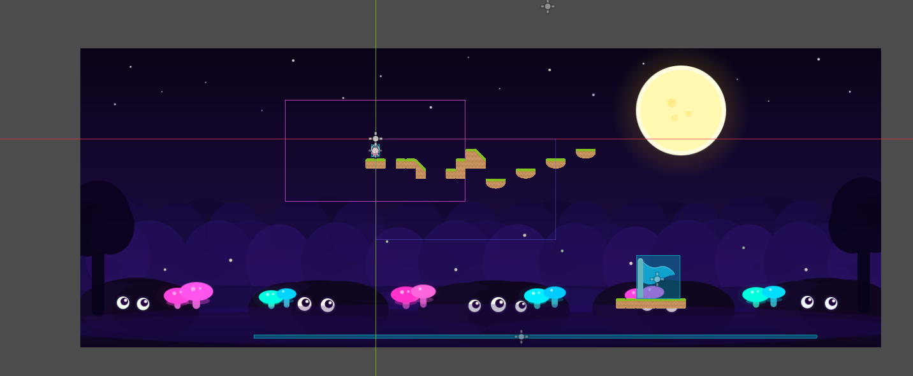

# Latihan Mandiri Tutorial 4: Basic 2D Level Design

**Nama:** Argya Farel Kasyara  
**NPM:** 2306152424  
**Mata Kuliah:** Game Development  

---

## Deskripsi Singkat
Repositori ini berisi implementasi Latihan Mandiri dari Tutorial 4. Pada tugas ini, saya membuat sebuah level 2D baru (Level 2) yang sepenuhnya berbeda dari Level 1. Level ini mengimplementasikan penggunaan `TileMapLayer` dengan aset yang berbeda, sistem kamera dinamis, kondisi menang/kalah menggunakan `Signals`, serta sebuah `Spawner` yang menjatuhkan rintangan mematikan secara berkala.

---

## Proses Pengerjaan

### 1. Pembuatan Level Baru dan Implementasi TileMap Berbeda
Untuk membuat suasana yang berbeda dari level pertama, saya menggunakan *spritesheet* baru untuk lingkungan level ini.

* **Pembuatan Scene:** Saya membuat *scene* baru bernama `Level2.tscn` sebagai arena bermain lalu saya menambahkan `Player.tscn` (yang sudah ada kameranya) sebagai child node dari level tersebut.
 
* **TileSet Baru:** Saya menambahkan *node* `TileMap` dan membuat sebuah `TileSet` baru. Berbeda dengan Level 1 yang menggunakan tema tanah (`spritesheet_gr_dirt.png`), pada level ini saya menggunakan aset rumput `spritesheet_gr_grass.png`.

* **Konfigurasi Fisika (Collision):** Agar karakter dapat berpijak pada blok, saya menambahkan *Physics Layer* pada `TileSet` dan menggambar poligon kolisi (*collision polygon*) pada setiap *tile* yang digunakan sebagai pijakan.

### 2. Sistem Kondisi Akhir Permainan (Menang & Kalah)
Saya memanfaatkan `Signals` (`body_entered`) pada *node* `Area2D` untuk memicu pergantian *scene* ketika pemain mencapai tujuan atau gagal.

* **Kondisi Kalah (Jurang):** Saya menempatkan *scene* `AreaTrigger` memanjang di bagian bawah level. Jika pemain terjatuh dan memasuki area ini, *signal* akan memicu *script* untuk mereset *scene* kembali ke `Level2.tscn`.
* **Kondisi Menang (Garis Akhir):** Saya membuat area tujuan di ujung level dengan *sprite* bendera biru. Jika pemain menyentuh `Area2D` pada objek ini, *scene* akan berpindah ke layar kemenangan (`WinScreen.tscn`).

### 3. Rintangan Jatuh Kustom & Sistem Spawner
Sesuai dengan syarat latihan mandiri, saya membuat rintangan baru yang dijatuhkan dari langit secara periodik.

* **Objek Rintangan Baru:** Saya tidak lagi menggunakan ikan. Saya membuat *scene* baru bertipe `RigidBody2D` dengan *sprite* gergaji bulat. Saya juga menambahkan *script* yang mendeteksi tabrakan dengan "Player"; jika tertabrak, *scene* akan berpindah ke layar kalah (`LoseScreen.tscn`).
* **Implementasi Spawner:** Saya menempatkan *node* `Node2D` bernama `Spawner` di bagian atas (langit) level. Saya menggunakan *script* `Spawner.gd` yang secara dinamis melakukan `instantiate()` pada *scene* rintangan baru setiap detik di koordinat X yang diacak.

## ✨ Polishing & Fitur Tambahan (Extra)

Selain memenuhi syarat wajib, saya juga menambahkan beberapa elemen *polishing* untuk meningkatkan *game feel* dan estetika pada Level 2:

1. **Parallax Background:** Saya mengimplementasikan *node* `Parallax2D`  untuk memberikan efek kedalaman (*depth*) pada latar belakang. Saat karakter dan kamera bergerak maju, latar belakang bergerak dengan kecepatan yang lebih lambat (`motion_scale < 1`), menciptakan ilusi 3D yang dinamis.
   

---

## 📚 Referensi
* [Modul Tutorial 4 Game Development]
* [Godot Docs: Using TileMaps](https://docs.godotengine.org/en/stable/tutorials/2d/using_tilemaps.html)
* [Godot Docs: Signals](https://docs.godotengine.org/en/stable/getting_started/step_by_step/signals.html)
* Gemini AI